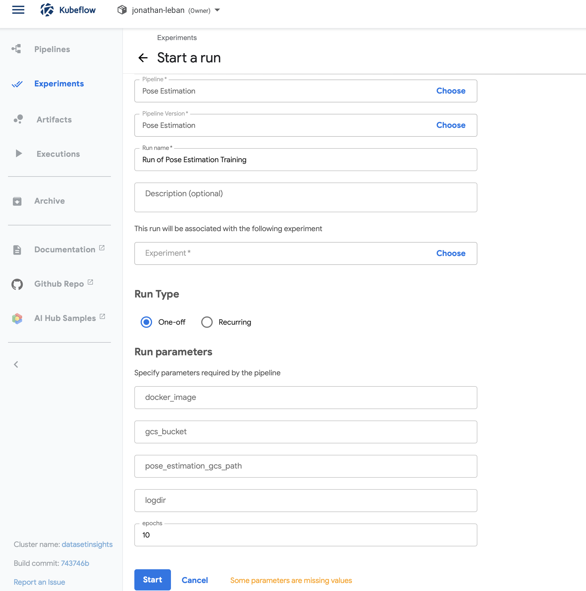

## Running on the Cloud 
Instead of training or evaluating your model on your local computer, you can use the cloud. The advantages of using the cloud are: 
- Speed
- No local storage problems
- No need to install packages or software on your computer 
- Can run on any computer and at any time without needing monitoring

To run the project on the cloud, you will need to change a few parameters in [config.yaml](../config.yaml) file. The steps are described in the section below, [Google Cloud Platform](#google-cloud-platform).
### Google Cloud Platform
Instead of extracting the data from your local computer, you can also download it form the cloud. In that case, you have two options: 
- If you want to access the cloud for your data in the Docker image, you will need to change the [config.yaml](../config.yaml) file. 
  - Under `dataset`, set `download_data_gcp` to `True`
  - Specify the string value for `gcs_bucket` and `pose_estimation_gcs_path`, where `pose_estimation_gcs_path` is the path under the `gcs_bucket`. 
    - For example, if you have called your gcs_bucket `pose-estimation` and you have created a new folder inside `pose-estimation` named `dataset`, then pose_estimation_gcs_path will be equal to `dataset`.
- If you want to use the kubeflow pipeline, you will only need to fill out the respective arguments when you create the pipeline as you can see on the picture below: 

However, please note that using a Cloud computing platform (Google Cloud, AWS, Azure) is charged. 

This project provides the code necessary to run your project on [kubeflow](#https://www.kubeflow.org/) where you can run [machine learning pipelines](#https://www.kubeflow.org/docs/pipelines/overview/pipelines-overview/). You will just need to follow the instructions in the [Kubeflow Pipeline](../kubeflow/README.md).