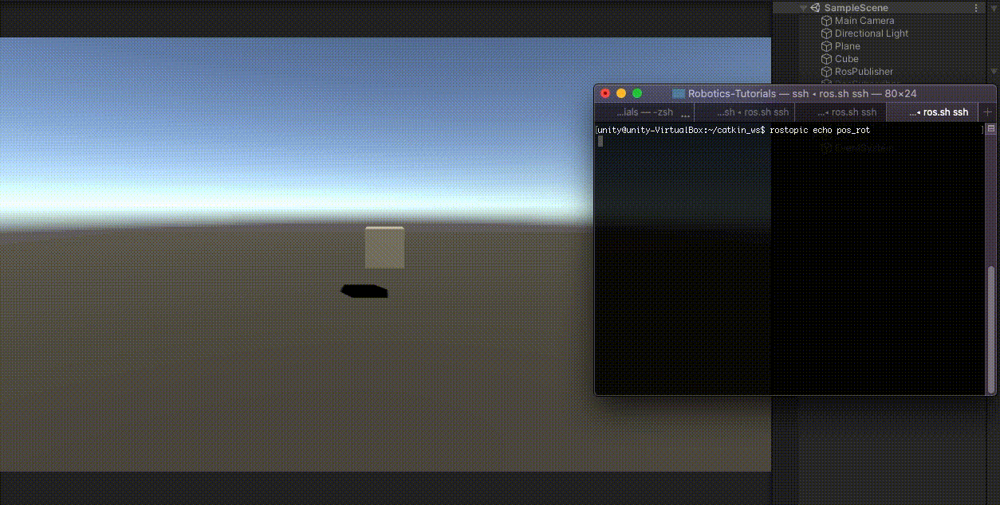

# ROS–Unity Integration: Publisher

Create a simple Unity scene which publishes a GameObject's position and rotation to a [ROS topic](http://wiki.ros.org/ROS/Tutorials/UnderstandingTopics#ROS_Topics).

These instructions cover the setup for both ROS1 and ROS2. If you're using ROS2, start with the [Setting Up ROS2](publisher.md#setting-up-ros2) section. Instructions for ROS2 users are marked with this icon: .

## Setting Up ROS

- Follow the [ROS–Unity Initial Setup](setup.md#ros2-environment) guide.

## Start the Echo monitor

- For this tutorial we will run the rostopic echo command, which watches the topic we're going to publish messages on, to prove they are being received.

- Open a new terminal window, navigate to your ROS workspace, and run the following commands:
	```bash
	source devel/setup.bash
	rostopic echo pos_rot
	```
-  In ROS2, the commands to run are
	
	```bash
	source install/setup.bash
	ros2 topic echo pos_rot
	```

- If it's working correctly it will print nothing and wait for a message to be published.

## Setting Up Unity Scene
- In the Project tab, create a new C# script and name it `RosPublisherExample`. Paste the following code into the new script file.
    - (Alternatively, you can drag the script file into Unity from `tutorials/ros_unity_integration/unity_scripts/RosPublisherExample.cs`)

```csharp
using UnityEngine;
using Unity.Robotics.ROSTCPConnector;
using RosMessageTypes.UnityRoboticsDemo;

/// <summary>
/// 
/// </summary>
public class RosPublisherExample : MonoBehaviour
{
    ROSConnection ros;
    public string topicName = "pos_rot";

    // The game object 
    public GameObject cube;
    // Publish the cube's position and rotation every N seconds
    public float publishMessageFrequency = 0.5f;

    // Used to determine how much time has elapsed since the last message was published
    private float timeElapsed;

    void Start()
    {
        // start the ROS connection
        ros = ROSConnection.instance;
        ros.RegisterPublisher<PosRotMsg>(topicName);
    }

    private void Update()
    {
        timeElapsed += Time.deltaTime;

        if (timeElapsed > publishMessageFrequency)
        {
            cube.transform.rotation = Random.rotation;
            
            PosRotMsg cubePos = new PosRotMsg(
                cube.transform.position.x,
                cube.transform.position.y,
                cube.transform.position.z,
                cube.transform.rotation.x,
                cube.transform.rotation.y,
                cube.transform.rotation.z,
                cube.transform.rotation.w
            );

            // Finally send the message to server_endpoint.py running in ROS
            ros.Send(topicName, cubePos);

            timeElapsed = 0;
        }
    }
}
```

- Add a plane and a cube to the empty Unity scene
- Move the cube a little ways up so it is hovering above the plane
- In the main menu bar, open `Robotics/ROS Settings`.
    - Set the ROS IP address and port to match the ROS IP and port variables defined when you started the ROS endpoint.
	-  If using ROS2, switch the protocol to ROS2.
	
	

- Create another empty GameObject, name it `RosPublisher` and attach the `RosPublisherExample` script.
    - Drag the cube GameObject onto the `Cube` parameter.

- Press play in the Editor. You should see the connection lights at the top left corner of the Game window turn blue, and something like `[INFO] [1622242057.562860400] [TCPServer]: Connection from 172.17.0.1` appear in the terminal running your server_endpoint.
	
	In the window running your echo monitor, you should see the contents of your messages from Unity appearing every 0.5 seconds.

> Please reference [networking troubleshooting](network.md) doc if any errors are thrown.



Continue to the [ROS Subscriber](subscriber.md) tutorial.