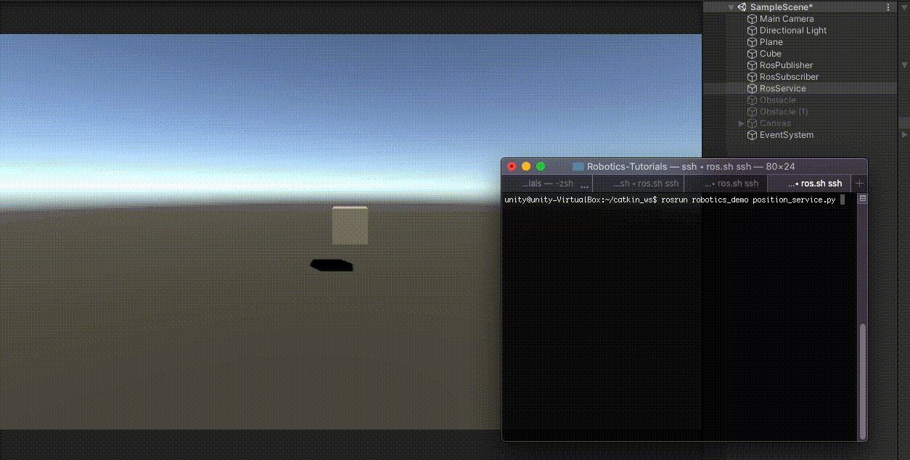

# Unity ROS Integration Service

Create a simple Unity scene which calls a [ROS service](http://wiki.ros.org/Services) with a game object's position and rotation to receive a new position to move the game object towards.

**NOTE:** If following from [Publisher](publisher.md) or [Subscriber](subscriber.md) tutorials proceed to [Setting Up Unity Scene](service.md#setting-up-unity-scene) step.

Follow the [Initial ROS Setup](setup.md) guide.

Follow the [ROS Message Generation](https://github.com/Unity-Technologies/Unity-Robotics-Hub/blob/master/tutorials/unity_ros_message_generation/message_generation_tutorial.md) guide.

Follow the [Setting Up ROS](ros_setup.md) guide.

- Run the following command in a separate terminal window:
	- `rostopic echo pos_rot`

## Setting Up Unity Scene
- Generate the C# code for `PositionService`'s messages by going to `RosMessageGeneration` -> `AutoGenerateServices` -> `Single Service...`
- Set the input file path to `PATH/TO/Unity-Robotics-Hub/tutorials/ros_packages/robotics_demo/srv/PositionService.srv` and click `GENERATE!`
    - The generated files will be saved in the default directory `Assets/RosMessages/srv`
- Create a script and name it `RosServiceExample.cs`
- Paste the following code into `RosServiceExample.cs`
- **Note** Script can be found at `tutorials/ros_unity_integration/unity_scripts`

```csharp
using System;
using RosMessageTypes.RoboticsDemo;
using UnityEngine;
using Debug = UnityEngine.Debug;

public class RosServiceExample : MonoBehaviour
{
    private TcpConnector tcpCon;

    public string serviceName = "pos_srv";
    public string hostName = "192.168.1.116";
    public int hostPort = 10000;

    public GameObject cube;

    // Cube movement conditions
    public float delta = 1.0f;
    public float speed = 2.0f;
    private Vector3 destination;

    void Start()
    {
        tcpCon = new TcpConnector(hostName, hostPort);

        destination = cube.transform.position;
    }

    private void FixedUpdate()
    {

        if (Vector3.Distance(cube.transform.position, destination) < delta)
        {
            Debug.Log("Destination reached.");

            PosRot cubePos = new PosRot(
                cube.transform.position.x,
                cube.transform.position.y,
                cube.transform.position.z,
                cube.transform.rotation.x,
                cube.transform.rotation.y,
                cube.transform.rotation.z,
                cube.transform.rotation.w
            );

            PositionServiceRequest positionServiceRequest = new PositionServiceRequest(cubePos);

            // Send message to ROS and return the response
            var response = (PositionServiceResponse) tcpCon.SendServiceMessage(serviceName, positionServiceRequest, new PositionServiceResponse());

            destination = new Vector3(response.output.pos_x, response.output.pos_y, response.output.pos_z);

            Debug.Log("New Destination: " + destination);
        }
        // Translate cube to destination
        else
        {
            // Move our position a step closer to the target.
            float step =  speed * Time.deltaTime; // calculate distance to move
            cube.transform.position = Vector3.MoveTowards(cube.transform.position, destination, step);
        }
    }
}
```

- Create an empty game object and name it `RosService`
- Attach the `RosServiceExample` script to the `RosService` game object and drag the cube game object onto the script
- In the Inspector window of the Editor change the `hostName` variable on the `RosService` game object to the ROS master URI. 
- Pressing play in the Editor should start communication with the `postion_service` script, running as a ROS node, causing the cube to move to random positions in the scene.


