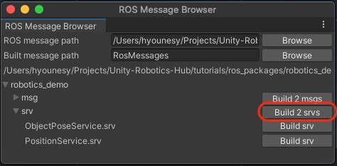

# ROS–Unity Integration: Service

Create a simple Unity scene which calls a [ROS service](http://wiki.ros.org/Services) with a GameObject's position and rotation to receive a new position to move the GameObject towards.

## Setting Up ROS

(Skip to [Start the Position service](service.md#start-the-position-service) if you already did the [ROS–Unity Integration Publisher](publisher.md) or [Subscriber](subscriber.md) tutorials.)

- Copy the `tutorials/ros_unity_integration/ros_packages/unity_robotics_demo` folder of this repo into the `src` folder in your Catkin workspace.

- Follow the [ROS–Unity Initial Setup](setup.md) guide.

- Open a new terminal window, navigate to your ROS workspace, and run the following commands:

   ```bash
    source devel/setup.bash
    rosrun robotics_demo server_endpoint.py
   ```

Once the server_endpoint has started, it will print something similar to `[INFO] [1603488341.950794]: Starting server on 192.168.50.149:10000`.

## Start the Position service
- Open a new terminal window, navigate to your ROS workspace, and run the following commands:

   ```bash
    source devel/setup.bash
    rosrun robotics_demo position_service.py
   ```

## Setting Up Unity Scene
- Generate the C# code for `PositionService`'s messages by going to `Robotics` -> `Generate ROS Messages...`
- Set the input file path to `PATH/TO/Unity-Robotics-Hub/tutorials/ros_unity_integration/ros_packages/robotics_demo`, expand the robotics_demo folder and click `Build 2 srvs`.



   - The generated files will be saved in the default directory `Assets/RosMessages/RoboticsDemo/srv`.
- Create a script and name it `RosServiceExample.cs`
- Paste the following code into `RosServiceExample.cs`
    - **Note:** This script can be found at `tutorials/ros_unity_integration/unity_scripts`.

```csharp
using RosMessageTypes.RoboticsDemo;
using UnityEngine;
using Unity.Robotics.ROSTCPConnector;

public class RosServiceExample : MonoBehaviour
{
    ROSConnection ros;

    public string serviceName = "pos_srv";

    public GameObject cube;

    // Cube movement conditions
    public float delta = 1.0f;
    public float speed = 2.0f;
    private Vector3 destination;

    float awaitingResponseUntilTimestamp = -1;

    void Start()
    {
        ros = ROSConnection.instance;
        destination = cube.transform.position;
    }

    private void Update()
    {
        // Move our position a step closer to the target.
        float step = speed * Time.deltaTime; // calculate distance to move
        cube.transform.position = Vector3.MoveTowards(cube.transform.position, destination, step);

        if (Vector3.Distance(cube.transform.position, destination) < delta && Time.time > awaitingResponseUntilTimestamp)
        {
            Debug.Log("Destination reached.");

            PosRotMsg cubePos = new PosRotMsg(
                cube.transform.position.x,
                cube.transform.position.y,
                cube.transform.position.z,
                cube.transform.rotation.x,
                cube.transform.rotation.y,
                cube.transform.rotation.z,
                cube.transform.rotation.w
            );

            PositionServiceRequest positionServiceRequest = new PositionServiceRequest(cubePos);

            // Send message to ROS and return the response
            ros.SendServiceMessage<PositionServiceResponse>(serviceName, positionServiceRequest, Callback_Destination);
            awaitingResponseUntilTimestamp = Time.time+1.0f; // don't send again for 1 second, or until we receive a response
        }
    }

    void Callback_Destination(PositionServiceResponse response)
    {
        awaitingResponseUntilTimestamp = -1;
        destination = new Vector3(response.output.pos_x, response.output.pos_y, response.output.pos_z);
        Debug.Log("New Destination: " + destination);
    }
}
```

- From the main menu bar, open `Robotics/ROS Settings`, and change the `ROS IP Address` variable to the ROS IP.
- Create an empty GameObject and name it `RosService`.
- Attach the `RosServiceExample` script to the `RosService` GameObject. Drag the cube GameObject onto its `cube` parameter.
- Pressing play in the Editor should start communication with the `position_service` script, running as a ROS node, causing the cube to move to random positions in the scene.


> Please reference [networking troubleshooting](network.md) doc if any errors are thrown.


