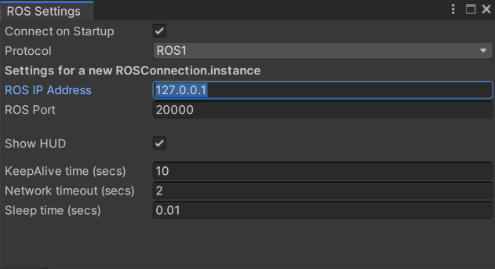
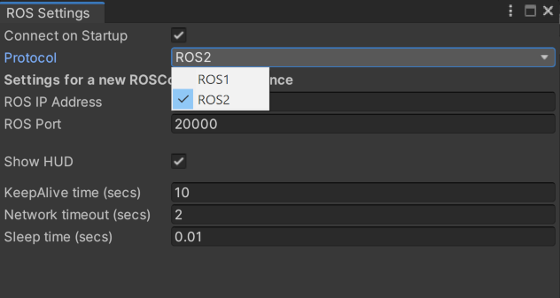

# ROS–Unity Initial Setup

The minimum requirements for a ROS–Unity integration. These instructions cover both ROS1 and ROS2.

 This symbol indicates instructions for ROS2 users. If using ROS2, you should skip to [ROS2 Environment](setup.md#-ros2-environment).

## ROS Environment

1. Follow these steps if using ROS (melodic or noetic):

1. Download and copy the [TCP Endpoint](https://github.com/Unity-Technologies/ROS-TCP-Endpoint) package to the `src` folder in your Catkin workspace.

1. Navigate to your Catkin workspace and run `catkin_make`, then `source devel/setup.bash`. Ensure there are no errors.

1. Open a new terminal, navigate to your Catkin workspace, and run:

   ```bash
   source devel/setup.bash
   roscore &
   ```

   Once ROS Core has started, it will print `started core service [/rosout]` to the terminal window.

1. The `server_endpoint` script we'll be using will require the ros parameter ROS_IP to be defined. You will need to know the IP address of your ROS machine; the command `hostname -I` can be used to find it. Or, if you're using Docker, the IP address to use is `0.0.0.0`.

1. Set the ros parameter using the command `rosparam set ROS_IP 127.0.0.1`, replacing this IP address with the appropriate IP address or hostname.

1. By default, the server_endpoint will listen on port 10000, but this is also controlled by a parameter. If you need to change it, you can run the command `rosparam set ROS_IP 10000`, replacing 10000 with the desired port number.

1. (Optional) If you're going through this process often, you may find it useful to set the ROS parameter values using a YAML file. To do this, create a `params.yaml` file in your package, e.g. `./config/params.yaml`. Open the file for editing.

 Update the `ROS_IP` below with the appropriate address and copy the contents into the `params.yaml` file.

    ```yaml
    ROS_IP: <your ROS IP>
    ROS_TCP_PORT: 10000
    ```

    e.g.

    ```yaml
    ROS_IP: 127.0.0.1
    ROS_TCP_PORT: 10000
    ```

 Set these newly defined parameters by running `rosparam load`, e.g.:

    ```bash
    rosparam load PATH/TO/config/params.yaml
    ```
    Alternatively, this YAML can be loaded from a launch file, e.g.:

    ```xml
    <launch>
        <rosparam file="$(find <PACKAGE_NAME>)/config/params.yaml" command="load"/>
    </launch>
    ```

> Read more about rosparam YAML options [here](http://wiki.ros.org/rosparam).
>
> Read more about the ROS Parameter Server [here](http://wiki.ros.org/Parameter%20Server).

##  ROS2 Environment

1. Follow these steps if using ROS2:

1. Download the [ROS2 TCP Endpoint](https://github.com/Unity-Technologies/ROS2-TCP-Endpoint) repository and copy the folders `ROS2_packages/ros2_tcp_endpoint` and `ROS2_packages/unity_interfaces` into the `src` folder in your Colcon workspace.

1. Navigate to your Colcon workspace and run the following commands
    ```bash
    colcon build
	source install/setup.bash
	```
	
	Ensure there are no errors.

## Unity Scene
1. Launch Unity and create a new project.
2. Open Package Manager and click the + button at the top left corner. Select "add package from git URL" and enter "https://github.com/Unity-Technologies/ROS-TCP-Connector.git?path=/com.unity.robotics.ros-tcp-connector" to install the [ROS TCP Connector](https://github.com/Unity-Technologies/ROS-TCP-Connector) package.

  

  

3. For this step you'll need to know the incoming IP address of your ROS machine; if you don't know it, the command `hostname -I` will print it. Or, if you're using Docker, the default IP address to use is `0.0.0.0`.

  From the Unity menu bar, open `Robotics/ROS Settings`, and set the `ROS IP Address` variable to your ROS IP.
	

4.  If you're using ROS2, still in the ROS Settings window, switch the protocol to ROS2.
	

## Setting up the Ros-Unity Integration tutorials

The instructions so far have set up the ROS-TCP-Connector package for general use. If you are specifically following one of the [Ros-Unity-Integration tutorials](README.md), you'll need to do the following additional steps:

1. Copy `unity_robotics_demo` and `unity_robotics_demo_msgs` from the `tutorials/ros_unity_integration/ros_packages` folder of this repo into the `src` folder in your Catkin workspace, and run `catkin_make` again.

    -  If using ROS2, instead copy them from`tutorials/ros_unity_integration/ros2_packages` into the `src` folder of your Colcon workspace, and run `colcon build` again.

2. Open a new terminal window and run the following commands, replacing the IP address 127.0.0.1 with the IP or hostname you set in Unity earlier. (If using Docker, the IP to use is 127.0.0.1.)

   ```bash
    source devel/setup.bash
	rosparam set ROS_IP 127.0.0.1
    rosrun ros_tcp_endpoint default_server_endpoint.py
   ```

	-  If using ROS2, use these commands instead:
	
	```bash
    source install/setup.bash
	ros2 run ros2_tcp_endpoint default_server_endpoint --ros-args -p ROS_IP:=127.0.0.1
    ```

  Once the server_endpoint has started, it will print something similar to `[INFO] [1603488341.950794]: Starting server on 192.168.50.149:10000`.

3. (Optional) If you need the server to listen on a port that's different from the default 10000, you can also set the ROS_TCP_PORT parameter with the command `rosparam set ROS_TCP_PORT 20000` (or whatever port you want.)
	
	-  In ROS2 the command becomes `ros2 run unity_robotics_demo server_endpoint --ros-args -p ROS_IP:=127.0.0.1 -p ROS_TCP_PORT:=20000`


4. In the Unity menu bar, go to `Robotics` -> `Generate ROS Messages...`. In the Message Browser window, click the Browse button at the top right to set the ROS message path to `tutorials/ros_unity_integration/ros_packages/unity_robotics_demo_msgs` in whatever path you downloaded the Unity-Robotics-Hub repo into.

  (Note: The version in the ros2_packages folder is equivalent; Ros2 users can feel free to use it, or not.)

5. In the message browser, expand the unity_robotics_demo_msgs subfolder and click "Build 2 msgs" and "Build 2 srvs" to generate C# scripts from the ROS .msg and .srv files.

  

  The generated files will be saved in the default directories `Assets/RosMessages/UnityRoboticsDemo/msg` and `Assets/RosMessages/UnityRoboticsDemo/srv`.
