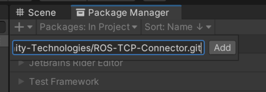

# ROS–Unity Initial Setup

The minimum requirements for a ROS–Unity integration.

## ROS Environment

1. Follow these steps if using ROS (melodic or noetic):

1. Download and copy the [TCP Endpoint](https://github.com/Unity-Technologies/ROS-TCP-Endpoint) package to the `src` folder in your Catkin workspace.

1. Navigate to your Catkin workspace and run `catkin_make`, then `source devel/setup.bash`. Ensure there are no errors.

1. Open a new terminal, navigate to your Catkin workspace, and run:

   ```bash
   source devel/setup.bash
   roscore &
   ```

   Once ROS Core has started, it will print `started core service [/rosout]` to the terminal window.

1. The `server_endpoint` script we'll be using will require the ros parameter ROS_IP to be defined. You will need to know the IP address of your ROS machine; the command `hostname -I` can be used to find it. Or, if you're using Docker, the IP address to use is `0.0.0.0`.

1. Set the ros parameter using the command `rosparam set ROS_IP 127.0.0.1`, replacing this IP address with the appropriate IP address or hostname.

1. By default, the server_endpoint will listen on port 10000, but this is also controlled by a parameter. If you need to change it, you can run the command `rosparam set ROS_IP 10000`, replacing 10000 with the desired port number.

1. (Optional) If you're going through this process often, you may find it useful to set the ROS parameter values using a YAML file. To do this, create a `params.yaml` file in your package, e.g. `./config/params.yaml`. Open the file for editing.

 Update the `ROS_IP` below with the appropriate address and copy the contents into the `params.yaml` file.

    ```yaml
    ROS_IP: <your ROS IP>
    ROS_TCP_PORT: 10000
    ```

    e.g.

    ```yaml
    ROS_IP: 127.0.0.1
    ROS_TCP_PORT: 10000
    ```

 Set these newly defined parameters by running `rosparam load`, e.g.:

    ```bash
    rosparam load PATH/TO/config/params.yaml
    ```
    Alternatively, this YAML can be loaded from a launch file, e.g.:

    ```xml
    <launch>
        <rosparam file="$(find <PACKAGE_NAME>)/config/params.yaml" command="load"/>
    </launch>
    ```

> Read more about rosparam YAML options [here](http://wiki.ros.org/rosparam).
>
> Read more about the ROS Parameter Server [here](http://wiki.ros.org/Parameter%20Server).

## ROS2 Environment

1. Follow these steps if using ROS2:

1. Download the [ROS2 TCP Endpoint](https://github.com/Unity-Technologies/ROS2-TCP-Endpoint) repository and copy the folders `ROS2_packages/ros2_tcp_endpoint` and `ROS2_packages/unity_interfaces` into the `src` folder in your Colcon workspace.

1. Navigate to your Colcon workspace and run the following commands
    ```bash
    colcon build
	source install/setup.bash
	```
	
	Ensure there are no errors.

## Unity Scene
1. Launch Unity and create a new scene.
2. Open Package Manager and click the + button at the top left corner. Select "add package from git URL" and enter "https://github.com/Unity-Technologies/ROS-TCP-Connector.git?path=/com.unity.robotics.ros-tcp-connector" to install the [ROS TCP Connector](https://github.com/Unity-Technologies/ROS-TCP-Connector) package.


