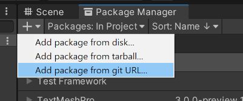

# ROS–Unity Demo Setup

This document is in two parts - part 1 covers the minimum requirements for a ROS–Unity integration. Part 2 sets up the Unity Robotics Demo package, which you will need if you're following the ROS–Unity Integration tutorials.

These instructions cover both ROS1 and ROS2. The symbols  and  indicate instructions for ROS1 and ROS2 users, respectively. If using ROS2, start with [ROS2 Environment](setup.md#-ros2-environment).

## ROS Environment

Follow these steps to use ROS (melodic or noetic):

1. Download and copy the [TCP Endpoint](https://github.com/Unity-Technologies/ROS-TCP-Endpoint) package to the `src` folder in your Catkin workspace.

1. Navigate to your Catkin workspace and run `catkin_make`, then `source devel/setup.bash`. Ensure there are no errors.

1. Open a new terminal, navigate to your Catkin workspace, and run:

   ```bash
   source devel/setup.bash
   roscore
   ```

   Once ROS Core has started, it will print `started core service [/rosout]` to the terminal window.

5. In your previous terminal, run the following command, replacing the IP address 127.0.0.1 with your ROS machine's IP or hostname. (If you don't know your IP address, you can find it out with the command `hostname -I`. If you're running ROS in a Docker container, the default incoming IP address is 0.0.0.0.)
    ```bash
    rosparam set ROS_IP 127.0.0.1
    ```

6. (Optional) By default, the server_endpoint will listen on port 10000, but this is also controlled by a parameter. If you need to change it, you can run the command `rosparam set ROS_TCP_PORT 10000`, replacing 10000 with the desired port number.

7. Start the server endpoint with the following command:

   ```bash
    rosrun ros_tcp_endpoint default_server_endpoint.py
   ```

   Once the server_endpoint has started, it will print something similar to `[INFO] [1603488341.950794]: Starting server on 192.168.50.149:10000`.

> Read more about rosparam YAML options [here](http://wiki.ros.org/rosparam).
>
> Read more about the ROS Parameter Server [here](http://wiki.ros.org/Parameter%20Server).

##  ROS2 Environment

Follow these steps if using ROS2:

1. 
   a) If you don't already have a ROS2 environment set up, we recommend using Docker. Navigate to `tutorials/ros_unity_integration` in your copy of this repo and run the following commands:

   ```bash
   git submodule init
   git submodule update
   docker build -t foxy -f ros2_docker/Dockerfile .
   docker run -it --rm -p 10000:10000 foxy /bin/bash
   ```
   
   This should build a docker image and start it.

   b) Alternatively, if you're not going to use the Docker image, download the [ROS2 branch of the ROS-TCP-Endpoint](https://github.com/Unity-Technologies/ROS-TCP-Endpoint/tree/ROS2) repository and copy it into the `src` folder in your Colcon workspace.

1. Navigate to your Colcon workspace and run the following commands
    ```bash
	source install/setup.bash
    colcon build
	source install/setup.bash
	```
	
	Note: yes, you need to run the source command twice. The first sets up the environment for the build to use, the second time adds the newly built packages to the environent.

5. In your Colcon workspace, run the following command, replacing the IP address 127.0.0.1 with your ROS machine's IP or hostname. (If you don't know your IP address, you can find it out with the command `hostname -I`.

	```bash
	ros2 run ros_tcp_endpoint default_server_endpoint --ros-args -p ROS_IP:=$(hostname -I)
    ```

   Once the server_endpoint has started, it will print something similar to `[INFO] [1603488341.950794]: Starting server on 192.168.50.149:10000`.

6. (Alternative) If you need the server to listen on a port that's different from the default 10000, here's the command line to also set the ROS_TCP_PORT parameter:

	```bash
	ros2 run ros_tcp_endpoint default_server_endpoint --ros-args -p ROS_IP:=127.0.0.1 -p ROS_TCP_PORT:=10000
	```

## Unity Scene
1. Launch Unity and create a new project.
2. Open Package Manager and click the + button at the top left corner. Select "add package from git URL" and enter "https://github.com/Unity-Technologies/ROS-TCP-Connector.git?path=/com.unity.robotics.ros-tcp-connector" to install the [ROS-TCP-Connector](https://github.com/Unity-Technologies/ROS-TCP-Connector) package.

  

  

3. From the Unity menu bar, open `Robotics/ROS Settings`, and set the `ROS IP Address` variable to the IP you set earlier. (If using a Docker container, you can leave it on the default 127.0.0.1).

	

4.  ROS2 users should also switch the protocol to ROS2 now.
	

## Setting up the ROS–Unity Integration tutorials

The instructions so far have set up the ROS-TCP-Connector package for general use. If you are specifically following one of the [ROS–Unity Integration tutorials](README.md), you'll need to do the following additional steps:

1. Copy the `unity_robotics_demo` and `unity_robotics_demo_msgs` packages into the `src` folder in your Catkin workspace. (Skip this step if you're using one of the Dockerfiles from this repo: they have the demo packages pre-installed.)

    - If using ROS1, copy them from from `tutorials/ros_unity_integration/ros_packages` in this repo.

    -  If using ROS2, copy them from `tutorials/ros_unity_integration/ros2_packages` in this repo.

1. Build the new packages.

	- In ROS1: Run `catkin_make`, and then `source devel/setup.bash` (again) so that ROS can find the newly built messages.

    -  In ROS2: run `colcon build`, then `source install/setup.bash` (again) so that ROS can find the newly built messages.

2. In the Unity menu bar, go to `Robotics` -> `Generate ROS Messages...`. In the Message Browser window, click the Browse button at the top right to set the ROS message path to `tutorials/ros_unity_integration/ros_packages/unity_robotics_demo_msgs` in this repo.

   (Note: The version in the ros2_packages folder is equivalent; ROS2 users can feel free to use it, or not.)

3. In the message browser, expand the unity_robotics_demo_msgs subfolder and click "Build 2 msgs" and "Build 2 srvs" to generate C# scripts from the ROS .msg and .srv files.

  

  The generated files will be saved in the default directories `Assets/RosMessages/UnityRoboticsDemo/msg` and `Assets/RosMessages/UnityRoboticsDemo/srv`.
