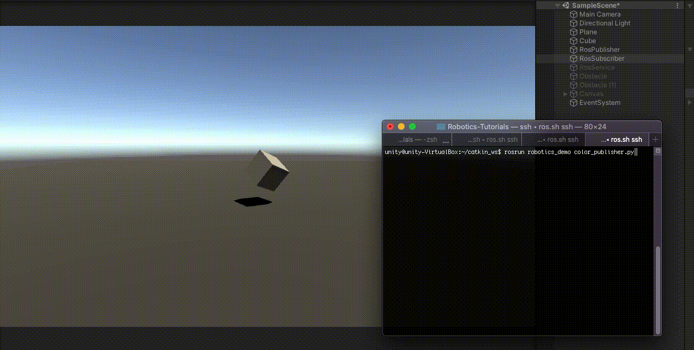

# ROS–Unity Integration: Subscriber

Create a simple Unity scene which subscribes to a [ROS topic](http://wiki.ros.org/ROS/Tutorials/UnderstandingTopics#ROS_Topics) to change the colour of a GameObject.

## Setting Up ROS

- Follow the [ROS–Unity Initial Setup](setup.md) guide if you haven't already done so.

## Setting Up Unity Scene

- In Unity, create a new C# script and name it `RosSubscriberExample`. Paste the following code into the new script file.
    (Alternatively, you can drag the script file into Unity from `tutorials/ros_unity_integration/unity_scripts/RosSubscriberExample.cs`.)

```csharp
using UnityEngine;
using Unity.Robotics.ROSTCPConnector;
using RosColor = RosMessageTypes.UnityRoboticsDemo.UnityColorMsg;

public class RosSubscriberExample : MonoBehaviour
{
	ROSConnection ros;
    public GameObject cube;

    void Start()
    {
        ros = ROSConnection.instance;
		ros.Subscribe<RosColor>("color", ColorChange);
    }

    void ColorChange(RosColor colorMessage)
    {
        cube.GetComponent<Renderer>().material.color = new Color32((byte)colorMessage.r, (byte)colorMessage.g, (byte)colorMessage.b, (byte)colorMessage.a);
    }
}
```

- Create an empty GameObject and name it `RosSubscriber`
- Attach the `RosSubscriberExample` script to the `RosSubscriber` GameObject and drag the cube GameObject onto the `cube` parameter in the Inspector window.

- Press play in the editor

### In ROS Terminal Window
- Run the following command: `rosrun unity_robotics_demo color_publisher.py` to change the color of the cube GameObject in Unity to a random color.

-  In ROS2, instead run `ros2 run unity_robotics_demo color_publisher`.

> Please reference [networking troubleshooting](network.md) doc if any errors are thrown.



Continue to the [ROS–Unity Integration Unity Service](unity_service.md).